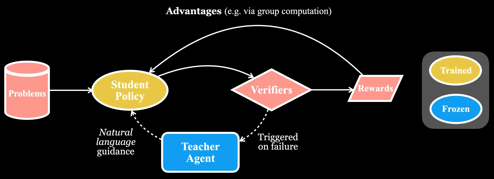

# Adaptive Guidance Accelerates Reinforcement Learning of Reasoning Models


<div align="center">



</div>

<div align="center">

[📄 Paper](https://www.arxiv.org/abs/2506.13923) | [🤗 Dataset](https://huggingface.co/datasets/vaskarnath/guide_math_rl_dataset) | [🐦 Twitter](https://x.com/SeanHendryx/status/1937224478351851764) | [✍️ Blog](https://scale.com/blog/future-ai-learning)

</div>

This repository contains the official implementation of the Guide-GRPO algorithm as described in the paper Adaptive Guidance Accelerates Reinforcement Learning of Reasoning Models, including all the necessary code to reproduce the experiments in our paper.

## Environment Setup

You can set up the environment using either a local build or a Docker build.

### Local Build

The local build uses `uv` to create a virtual environment and install the required packages.

**Prerequisites:**
* Python 3.10+
* `uv` installed (`pip install uv`)

To build the environment locally, run the following script from the root of the repository:

```bash
bash uv_build.sh
```

This script will:
1. Create a virtual environment in `.venv`.
2. Activate the virtual environment.
3. Install all the required packages from `verl/requirements.txt`.
4. Install additional packages such as `vllm`, `apex`, `flash-attn`, and `TransformerEngine`.
5. Install the `verl` package in editable mode.

### Docker Build

The Docker build sets up the environment within a container. The `Dockerfile.uv` is based on a PyTorch training image and automates the entire setup process.

## Running Experiments

The experiments for math reasoning are located in `verl/experiments/math_reasoning`.

### Running Experiments Locally

To run an experiment on your local machine, use the `run_local.sh` script. This script executes a single experiment configuration.

```bash
bash verl/experiments/math_reasoning/run/run_local.sh
```

By default, this script runs the `guide_grpo_qwen.sh` configuration on a single node. You can modify `run_local.sh` to point to a different experiment configuration file if needed. The experiment configurations are located in `verl/experiments/math_reasoning/configs/guide_paper_experiments/`.

Each configuration script (e.g., `guide_grpo_qwen.sh`) sets up the environment variables, defines the paths for data and models, and then launches the main training script `verl.trainer.main_ppo`.

## Citation and Acknowledgement

This work would not be possible without the open source contribution via the VeRL library:

```
@article{sheng2024hybridflow,
  title   = {HybridFlow: A Flexible and Efficient RLHF Framework},
  author  = {Guangming Sheng and Chi Zhang and Zilingfeng Ye and Xibin Wu and Wang Zhang and Ru Zhang and Yanghua Peng and Haibin Lin and Chuan Wu},
  year    = {2024},
  journal = {arXiv preprint arXiv: 2409.19256}
}
```

If you found Guide-GRPO and this work helpful, please cite:

```
@article{nath2025adaptiveguidanceacceleratesreinforcement,
      title={Adaptive Guidance Accelerates Reinforcement Learning of Reasoning Models}, 
      author={Vaskar Nath and Elaine Lau and Anisha Gunjal and Manasi Sharma and Nikhil Baharte and Sean Hendryx},
      year={2025},
      url={https://arxiv.org/abs/2506.13923}, 
}
```